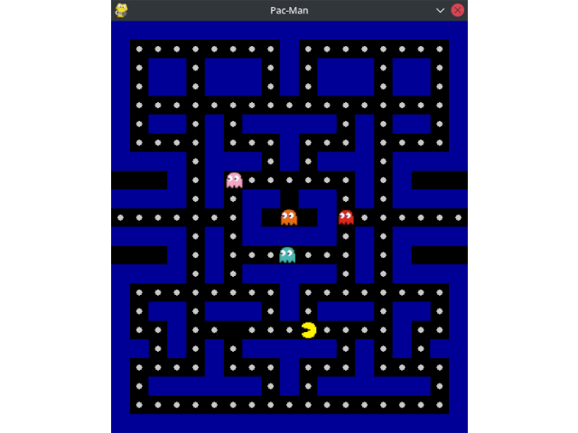

# Pac-Man

## Zrzut ekranu

## Opis

Program jest implementacją gry [Pac-Man](https://pl.wikipedia.org/wiki/Pac-Man).

Plansza gry składa się z czarnych i niebieskich pól. Czarne pola oznaczają miejsca, po których postacie mogą się poruszać, a niebieskie pola to ściany przez które postacie nie mogą przechodzić. Na czarnych polach mogą znajdować się punkty w postaci białych kół.

Gra polega na kierowaniu Pac-Manem (Żółtą okrągłą postacią) przy użyciu klawiszy strzałek, zbieraniu punktów i unikaniu duchów, poruszających się po planszy. Gdy duch znajdzie się w bliskiej odległości od postaci gracza, to zaczyna za nim podążać, w innym przypadku porusza się w sposób losowy. W przypadku dotknięcia ducha przez Pac-Mana gracz traci jedno życie, a położenie wszystkich postaci zostaje zresetowane do położenia początkowego. Na początku gry gracz posiada 3 życia. Po utracie wszystkich żyć program jest zatrzymywany, a gra kończy się.

Aktualna liczba żyć oraz liczba punktów gracza zapisane są na dole planszy.

## Wątki

- Główny wątek gry - uruchamia wątki Pac-Mana i duchów, wyświetla planszę i postacie oraz przetwarza akcje gracza,
- Pac-Man - wątek odpowiedzialny za aktualizowanie stanu postaci Pac-Man,
- 4 wątki każdego z duchów - odpowiedzialne za aktualizowanie stanu duchów.

## Sekcje krytyczne

### Muteksy:

- `_life_lock` w klasie `Game` - zapobiega występowaniu zjawiska hazardu w funkcji zmniejszającej liczbę żyć,
- `_point_lock` w klasie `Game` - zapobiega występowaniu zjawiska hazardu w funkcji zwiększającej liczbę punktów,
- `_turn_lock` w klasie `GameCharacter` - przeciwdziała występowaniu zjawiska hazardu w funkcji przetwarzającej wciśnięte klawisze i funkcji przetwarzającej kolizje postaci z ścianami.

## Powód dla którego wybrano taki temat

Jako cel projektu wybrana została implementacja gry "Pac-Man". Ta gra została wybrana ze względu na jej dużą popularność oraz występowanie w niej kilku niezależnych postaci które wchodzą ze sobą w interakcje, co pozwoliło na wykorzystanie wielowątkowości oraz sekcji krytycznych.
